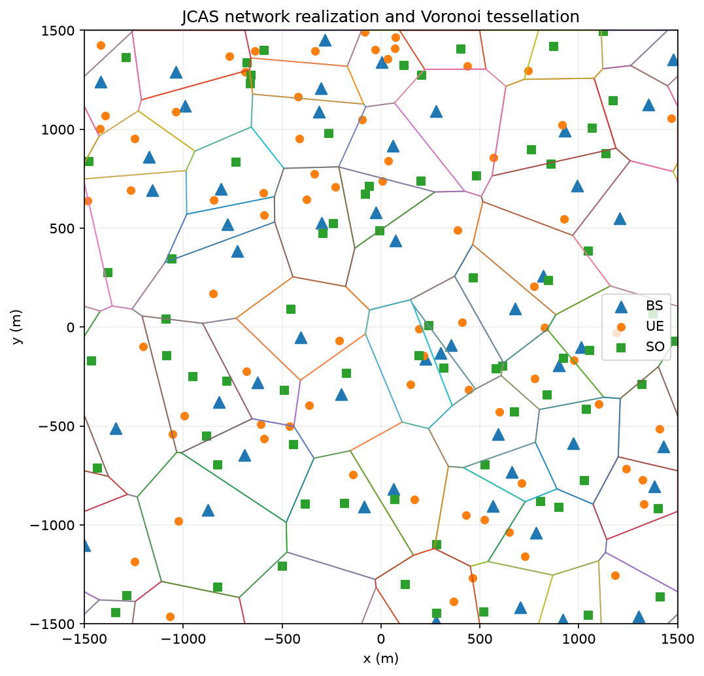
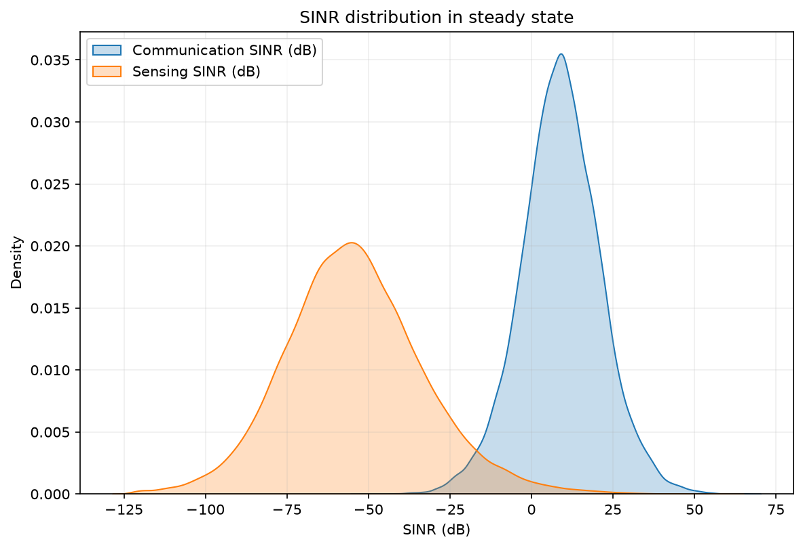
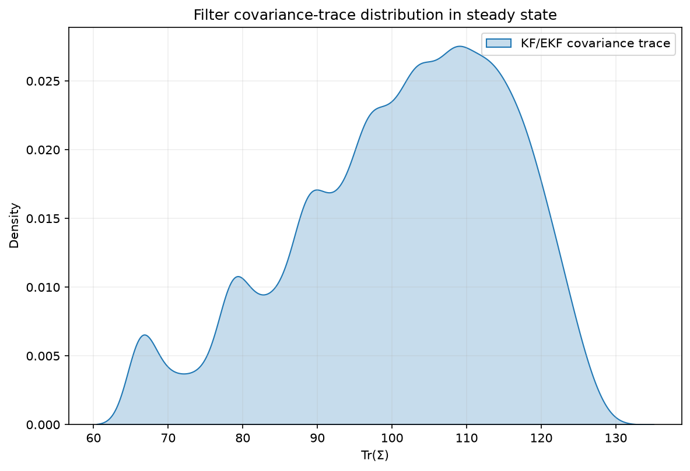
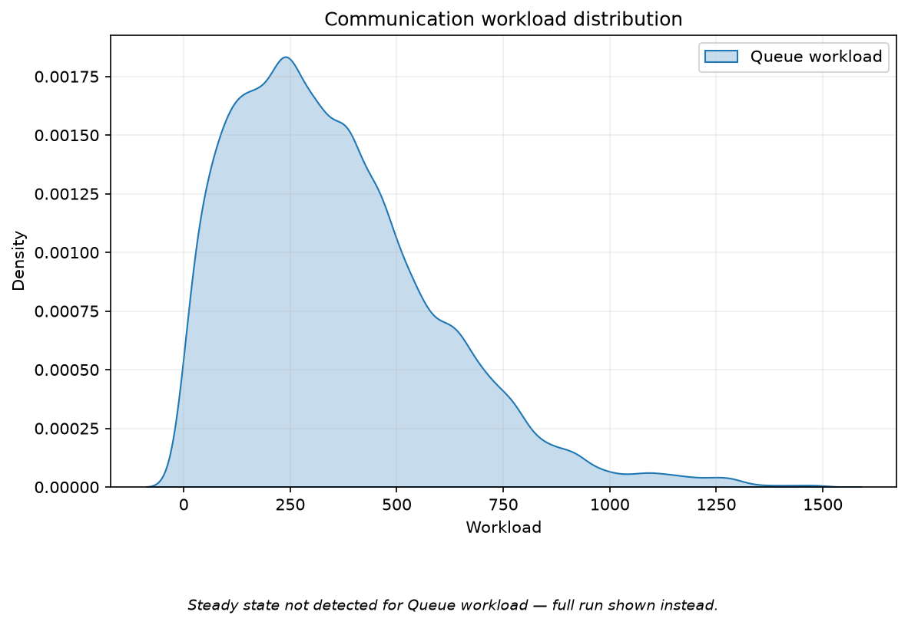
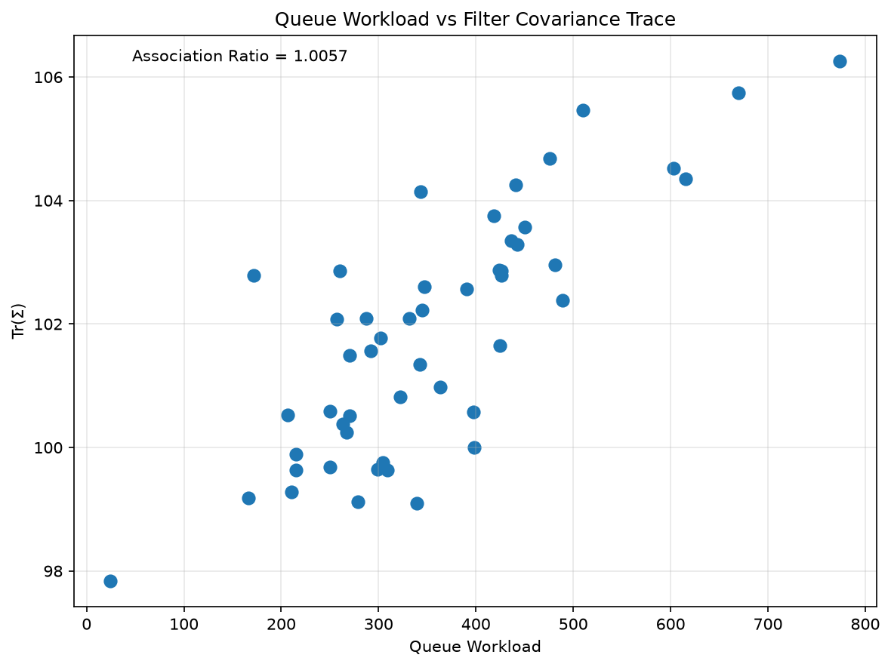
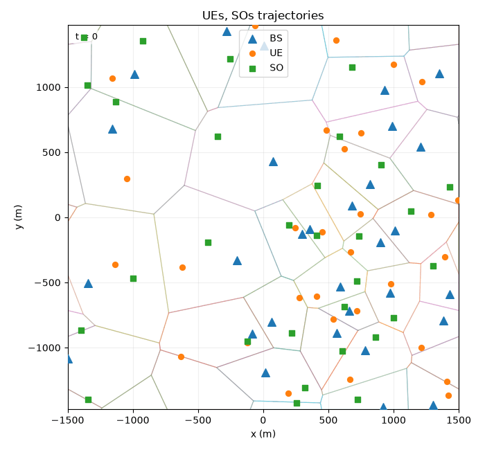
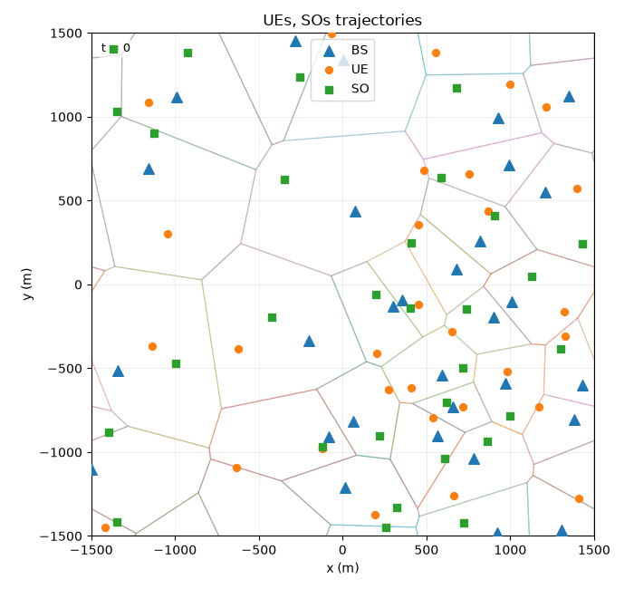

# JCAS Simulator

This repository provides a configurable simulator for **joint communication and sensing
(JCAS)** networks defined on a periodic (toroidal) spatial domain. Base stations (BSs), mobile
user equipments (UEs) and sensing objects (SOs) are placed on a rectangular flat torus, where a
Voronoi tessellation defines cell coverage. Every link is propagated through a physical
channel model and each SO is tracked with a Kalman (KF) or Extended Kalman
filter (EKF). The simulator is intended for the controlled study of how the communication and
sensing subsystems of a shared network interact.



*A single network realization on the flat torus — BS, UE and SO — with the induced Voronoi tessellation that defines cell coverage.*

## Contents

- [Overview](#overview)
- [Installation](#installation)
- [Usage](#usage)
  - [Interactive application](#interactive-application)
  - [Notebook and Python API](#notebook-and-python-api)
- [Simulation modes](#simulation-modes)
- [Configuration](#configuration)
- [Simulation output](#simulation-output)
- [Example output](#example-output)
- [Repository structure](#repository-structure)
- [Deployment](#deployment)
- [Citation](#citation)
- [License](#license)
- [References](#references)

## Overview

The simulator comprises the following components.

- **Network generation.** BSs are drawn from a homogeneous Poisson or Binomial (fixed count) point
  process. Each cell is then
  populated with UEs and SOs, placed either uniformly or as a Gaussian cluster around the
  serving BS.
- **Geometry.** All spatial computation uses the rectangular flat-torus (minimum-image)
  metric. The Voronoi tessellation, mobility models, filtering, beamforming and handover
  logic are periodic, which removes boundary effects that would otherwise bias
  spatially aggregated statistics. 
- **Mobility.** UEs and SOs follow a stationary, captive Gauss–Markov, or ρ-persistent
  random-walk motion model, with state represented as position or as position and
  velocity. The initial speed is used by the simulated motion only in the ρ-persistent
  random walk; under captive Gauss–Markov it enters the tracked state and therefore
  affects parameter estimation alone.
- **Channel.** Two physical channel models are provided. The ray-traced model (`rt`) is
  parameterised from a measurement-campaign fit produced with the University of Oulu ray
  tracer [[1]](#references) for the INSTINCT 6G project [[2]](#references). The
  Rayleigh-fading power-law model (`exponential`) is given by
  `H · max(d_min, d)^(-alpha)` with `H ~ Exp(mean)`.
  Transmit power, noise, bandwidth and carrier frequency are shared across models, as is
  the choice between one-way and two-way (monostatic-radar) sensing gain. Additional
  channel models may be registered at run time through `register_channel_model`.
- **Communication.** Each UE is served by a Lindley queue whose service rate depends on
  the instantaneous SINR, yielding a per-cell workload time series.
- **Sensing and filtering.** Observations are linear or radar-style (range, bearing and
  optionally range rate), with measurement noise that scales with SINR. These are
  processed by a KF (linear observations) or an E KF
  (nonlinear observations); the trace of the estimation-error covariance is used as the
  sensing-uncertainty metric.
- **Optional mechanisms.** Directional sector beamforming and a cyclic time-division
  duplex (TDD) communication/sensing schedule may be enabled.
- **Coupling metrics.** For each BS, the communication and sensing quantities
  are averaged and then summarised by an *association ratio*,
  `A(X, Y) = E[XY] / (E[X] · E[Y])`, together with the Pearson correlation, for the
  interference, SINR and queue-versus-covariance pairs. Values of the association ratio
  above one indicate positive co-fluctuation across the network, values below one
  indicate a trade-off and independence yields one.

Each simulation is fully determined by its `master_seed`, which drives a per-stream
seeded random-number manager, so results are exactly reproducible.

> [!NOTE]
> The `rho_random_walk` motion model lets entities roam across cell boundaries and
> re-associate to a new base station, so it is the model used for **handover**
> scenarios (set `handover_enabled=True`). The `captive_gauss_markov` model contracts
> each entity toward its serving base station and is used to model the **no-handover**
> case.

## Installation

The simulator requires **Python 3.10 or newer**.

```bash
git clone https://github.com/emanuelemengoli/instinct-jcas-simulator.git
cd instinct-jcas-simulator
./setup.sh
source .venv/bin/activate
```

`setup.sh` creates a virtual environment (`.venv`) in the repository root and installs
the dependencies listed in `requirements.txt` (NumPy, SciPy, Shapely, Matplotlib,
seaborn, Jupyter, pytest and Streamlit). It may be re-run safely, as it reuses an
existing environment rather than recreating it. The interpreter used to create the
environment can be overridden, for example `PYTHON_BIN=python3.12 ./setup.sh`.

On Windows, the equivalent steps are:

```powershell
python -m venv .venv
.venv\Scripts\activate
pip install -r requirements.txt
```

The package is not installed into the environment. Import `jcas_simulator` and run
scripts or notebooks from the repository root.

## Usage

The simulator can be driven in two ways:

- an **interactive web application** (`simulator_interface.py`), which exposes the most
  commonly varied parameters through form controls and displays the resulting figures in
  a browser; and
- a **notebook** (`main.ipynb`) and the underlying **Python API**, which expose the
  complete configuration and are suited to scripted experiments and ablation studies.

### Interactive application

```bash
streamlit run simulator_interface.py
```

Select a scenario in the sidebar — the **large-scale simulator** (the full network
simulator) or the **non-captive toy model** (a simplified single-track
experiment comparing JCAS tracking against a sensing-only baseline) — configure its
parameters and click **Run simulation**. The results are presented as a set of tabs:
the network and Voronoi view, SINR and filtering distributions, communication/sensing
association scatter plots, an animated trajectory sequence and a summary. The summary
tab includes a note titled *Interpretation of simulation outputs*, which gives the
precise definition of the association ratio, its relationship to the Pearson
correlation and guidance on reading the scatter plots and kernel density estimates.

Each run's summary tab provides an **export** section:

- **Download all images (ZIP)** — every figure produced for the run and the trajectory
  animation if it was generated, as PNG files.
- **Download parameters (LaTeX)** — the parameters of the run as a standalone `.tex`
  file containing a `booktabs` table, which compiles directly with `pdflatex`.

The ray-traced channel (`rt`) is considerably slower than the Rayleigh-fading channel
(`exponential`); the application displays a warning before such a run.

### Notebook and Python API

```bash
jupyter notebook main.ipynb
```

`main.ipynb` demonstrates the full `SimulationConfig` API, including the
region, network, mobility, channel, filtering, beamforming and TDD settings; the
RT-versus-exponential channel-law comparison; and the non-captive tracking model. Every
plotting function in `jcas_simulator.visualization` accepts the result object, together
with options (such as a save path, logarithmic axes, or trajectory subsetting) that are
not exposed by the application.

A minimal run is as follows.

```python
from jcas_simulator import (
    JCASSimulator, SimulationConfig, NetworkConfig, RegionConfig,
    PointProcessConfig, PopulationConfig, ChannelConfig,
    FilterConfig, ObservationConfig,
)

config = SimulationConfig(
    master_seed=42,
    horizon=200,
    network=NetworkConfig(
        region=RegionConfig(width=3000.0, height=3000.0),
        base_stations=PointProcessConfig(fixed_count=30),
        ue_population=PopulationConfig(count_model="fixed", fixed_per_cell=1),
        so_population=PopulationConfig(count_model="fixed", fixed_per_cell=1),
    ),
    channel=ChannelConfig(model="exponential"),
    filtering=FilterConfig(observation=ObservationConfig(kind="linear")),
)

result = JCASSimulator(config).run()
print(result.summary())
```

Because `SimulationConfig` is an immutable (frozen) dataclass tree, `dataclasses.replace`
supports concise ablation studies in which a single field is varied while all others are
held fixed — for example,
`replace(config, channel=replace(config.channel, model="rt"))` for the
RT-versus-Rayleigh channel-law comparison, or
`filtering=FilterConfig(kind="ekf", observation=ObservationConfig(kind="range_bearing"))`
for nonlinear, radar-style tracking.

## Simulation modes

`SimulationConfig.operation_mode` selects between two distinct simulation strategies,
each shown in the application under the label below.

| `operation_mode`         | Application label         | Description |
| ------------------------ | ------------------------- | ----------- |
| `large_scale_simulator`  | **Large-scale simulator** | The full large-scale network simulator described above. Returns a `LargeScaleSimulationResult`. |
| `non_captive_toy_model`  | **Non-captive toy model** | A supplied, simplified single-track experiment that compares JCAS tracking against a sensing-only baseline along a fixed line of BSs. It contains no ray-traced channel, sector beamforming, or TDD frame. Returns a `NonCaptiveToyModelSimulationResult`. |

## Configuration

A simulation is specified by a single `SimulationConfig`, an immutable dataclass tree
covering the region, network, mobility, channel, communication, filtering, beamforming,
TDD and non-captive-model settings. The configuration is validated on construction;
in particular, `RegionConfig.distance_model` must be `"toroidal"`. The file
`jcas_simulator/config.py` documents every field and its default value and `main.ipynb`
provides worked examples. The application's sidebar exposes the subset of parameters that
is varied most frequently.

## Simulation output

`JCASSimulator(config).run()` returns a `LargeScaleSimulationResult` in the
`large_scale_simulator` mode and a `NonCaptiveToyModelSimulationResult` in the
`non_captive_toy_model` mode.

For the large-scale-simulator result:

- `result.summary()` returns the entity counts, whether beamforming and TDD were active,
  and the association metrics.
- `result.association` contains the keys `interference`, `sinr` and `filter_queue`,
  each mapping to an `association_ratio` and a `pearson` value.
- `result.queue_workloads`, `result.communication_sinr`, `result.sensing_sinr`,
  `result.covariance_traces`, `result.ue_trajectories` and `result.so_trajectories`
  provide per-entity time series.
- `result.bs_metrics` contains the per-base-station means from which the association
  metrics are computed.

For the non-captive-toy-model result:

- `result.true_state`, `result.jcas_estimate` and `result.sensing_only_estimate` hold
  the ground-truth track and the two filter estimates.
- `result.position_error_jcas` and `result.position_error_sensing_only` (with their
  `smoothed_` counterparts) and `result.percent_error` quantify the JCAS-versus-baseline
  tracking improvement over time.
- `result.jcas_snr`, `result.sensing_only_snr` and `result.jcas_covariance` provide the
  per-step link and estimation quality.

## Example output

The figures below come from a single large-scale-simulator run under the ray-traced channel
configuration (`rt` channel), generated with the plotting helpers in `jcas_simulator.visualization`.
Every figure for a run is also available from the application's export panel.

### Steady-state distributions

<table>
  <tr>
    <td align="center">Communication / sensing SINR</td>
    <td align="center">Filter covariance trace</td>
    <td align="center">Queue workload</td>
  </tr>
  <tr>
    <td></td>
    <td></td>
    <td></td>
  </tr>
</table>

Kernel density estimates pooled across entities in the steady-state window: the per-link
communication and sensing SINR (the monostatic sensing return is far weaker than the
communication link), the KF/EKF error-covariance trace `Tr(Σ)` used as the
sensing-uncertainty metric and the per-cell Lindley-queue workload. Where a steady state is not
detected, the full run is shown instead.

### Queue–covariance association



Per-base-station mean queue workload against mean filter covariance trace. Here the association
ratio `A(W, Tr(Σ)) = E[W·Tr(Σ)] / (E[W]·E[Tr(Σ)]) ≈ 1.006 > 1`, indicating that communication
congestion and sensing uncertainty co-increase weakly across the network.

### Trajectory animations

<table>
  <tr>
    <td align="center">Captive Gauss–Markov</td>
    <td align="center">ρ-persistent random walk</td>
  </tr>
  <tr>
    <td></td>
    <td></td>
  </tr>
</table>

Entity trajectories over a run. Under **captive Gauss–Markov** (`captive_gauss_markov`, left)
each entity is contracted toward its serving base station and stays within its cell — the
no-handover regime. Under the **ρ-persistent random walk** (`rho_random_walk`, right) entities
carry momentum and roam across cell boundaries, the regime in which handover applies.

## Repository structure

```
simulator_interface.py       Streamlit application
main.ipynb                   Configuration-API notebook (examples, channel-law comparison)
setup.sh                     Creates the virtual environment and installs dependencies
requirements.txt             Python dependencies
jcas_simulator/              Simulator package
  config.py                    Configuration dataclasses (SimulationConfig, ...)
  simulator.py                 Orchestration (JCASSimulator, LargeScaleJCASSimulator)
  network.py                   Stochastic network generation (point process -> Voronoi -> UEs/SOs)
  geometry.py                  Toroidal distance and displacement, periodic Voronoi tessellation
  mobility.py                  Motion models and initial states
  channel.py                   Physical channel models (rt, exponential) and the channel registry
  communication.py             Lindley queue
  sensing.py                   Observation models and SINR-dependent measurement noise
  filtering.py                 KFs and EKFs
  beamforming.py               Directional sector beamformer
  scheduling.py                Cyclic TDD scheduler
  metrics.py                   Association ratio and Pearson correlation
  rng.py                       Per-stream seeded random-number manager
  non_captive_toy_model/       Supplied non-captive tracking model
  visualization/               Plotting (Voronoi, KDEs, association scatter plots, trajectory animation)
```

## Deployment

The application uses no external services or secrets and can therefore be deployed
without modification to [Streamlit Community Cloud](https://streamlit.io/cloud): push the
repository to GitHub, connect it on Streamlit Community Cloud and set the entry point to
`simulator_interface.py`. Any host able to run
`pip install -r requirements.txt && streamlit run simulator_interface.py` is equally
suitable.

## Citation

If this simulator is used in academic work, please cite the repository:

```bibtex
@misc{mengoli2026jcas,
  author       = {Mengoli, Emanuele},
  title        = {{JCAS Simulator}: a toroidal joint communication and sensing network simulator},
  year         = {2026},
  howpublished = {\url{https://github.com/emanuelemengoli/instinct-jcas-simulator}},
  note         = {Software}
}
```

## License

This project is released under the MIT License. The full text is given in the
[LICENSE](LICENSE) file.

## References

1. J. Pyhtilä, J. Kokkoniemi, P. Sangi, N. Vaara and M. Juntti, "Ray Tracing Based Radio
   Channel Modelling Applied to RIS," in *WSA & SCC 2023; 26th International ITG Workshop
   on Smart Antennas and 13th Conference on Systems, Communications, and Coding*, 2023,
   pp. 1–6.

   ```bibtex
   @inproceedings{Pyhtila2023,
     author    = {Pyhtil{\"a}, Juha and Kokkoniemi, Joonas and Sangi, Pekka and Vaara, Niklas and Juntti, Markku},
     title     = {Ray Tracing Based Radio Channel Modelling Applied to {RIS}},
     booktitle = {WSA \& SCC 2023; 26th International ITG Workshop on Smart Antennas and 13th Conference on Systems, Communications, and Coding},
     year      = {2023},
     pages     = {1--6}
   }
   ```

2. INSTINCT — Joint Sensing and Communication for Future Connectivity, Barkhausen
   Institut.
   <https://www.barkhauseninstitut.org/en/instinct-joint-sensing-and-communication-for-future-connectivity>
